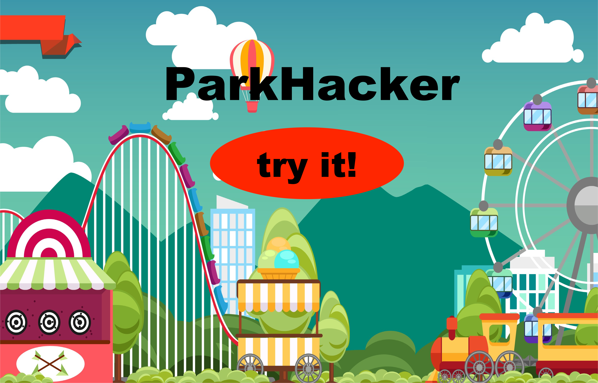

# **ParkHacker** :
### _navigate the most efficient route through a theme park_

#### (A TDI Data Science Fellowship capstone project)

Every year, many families and groups plan vacations that are centered around visiting theme parks.  While various theme parks have different assortments of things to do, one thing that they unfortunately all have in common is long, boring lines.

Current ride wait time data is available via park-specific apps, but they are of limited use in planning your trip or if you'd rather not spend your day at the park looking up wait times on your phone.

With the **ParkHacker** website, you simply enter the park you wish to visit, the day of your visit, the time you plan to arrive at the park, and the rides you want to go on.  In return, **Park Hacker** will output a customized itinerary to minimize wait times!

